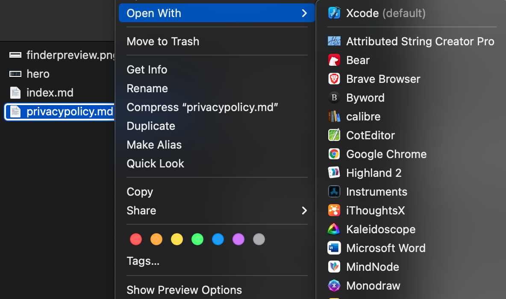
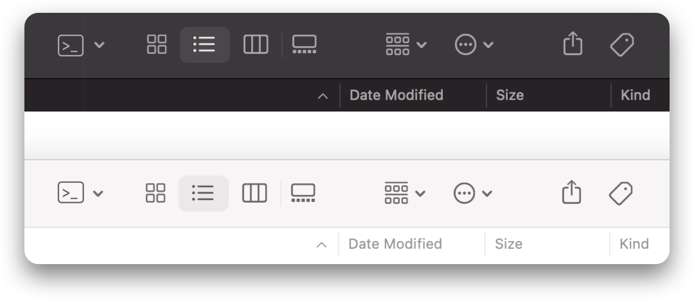
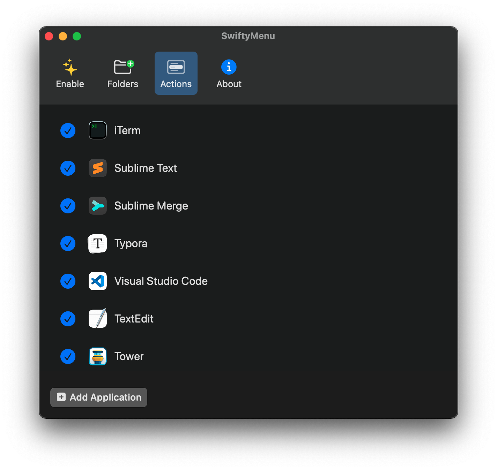
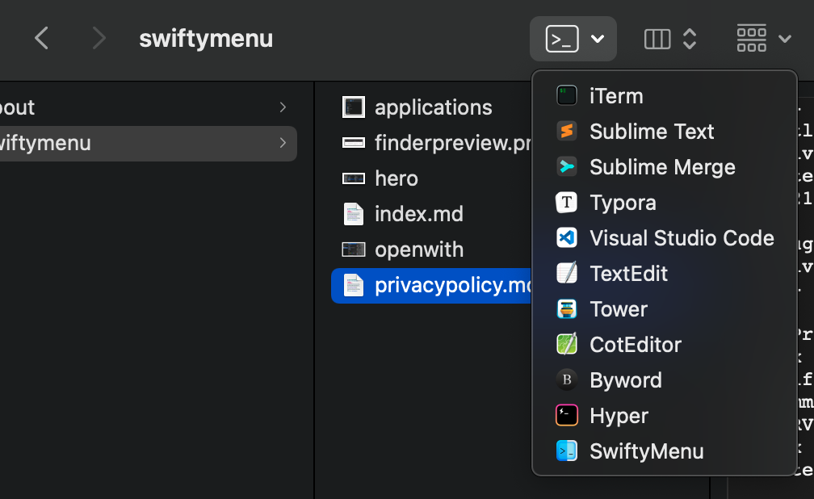

Mac 系统中有很多优秀的开发工具，同样做一件事可以选择不同的工具。
比如，几乎所有工具都能编写 Markdown，要写技术文档的时候我会用 Typora，想要更快速地打开 Markdown 文件只改几个字我会用 Sublime Text。而 Finder 中自带的选择方式是右键点 Open With：

但有时候这样做并不方便，很多工具还支持编辑目录，目录的右键菜单中没有这个选项。

SwiftyMenu 就是一款用来简化这个选择过程的工具。它是我用 Swift 编写的 Finder 插件，你可以用它在 Finder 工具栏中增加常用的工具，这样在你选中文件或目录时能更快地选择合适的工具。它提供了一个和 Finder 菜单体验一致的按钮，这一点非常重要，因为我没能找到一种能融入系统，并且不显得突兀的工具。所以我开始做这个插件的第一件事，就是在 Sketch 里画出了按钮的样子：

通过 SwiftyMenu 主 app，你可以设置菜单中要出现哪些应用，并能拖动排序：

这样，Finder 中就会有这样的菜单：

从此，打开程序变得变得非常方便 😎。

SwiftyMenu 现已上架 Mac App Store：
https://apps.apple.com/app/swiftymenu/id1567748223