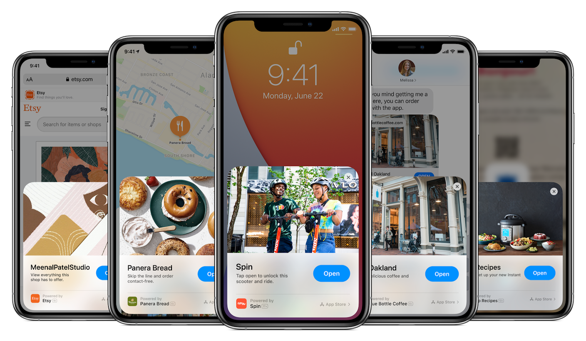

App clips 是 iOS 14 中新增的一种轻量级应用，WWDC 2020 中有六个 sessions 介绍了它的设计理念和开发方法。大部分人刚看到它的时候可能会联想到国内的小程序生态，以及 Google 的 Play Instant。但经过初步了解，不难发现这个苹果亲儿子在某些场景下和小程序相比，有着系统支持上的天然优势。

> 关于名称大小写，参考 [App Clips 主页](https://developer.apple.com/app-clips/) 中的使用方法，在正文中出现时可以全部小写。

### 宿主应用

App clips 并不像小程序一样可以独立存在，而是类似 WATCH Apps，需要有宿主 App。这意味着，你不能为了发布一个 app clip 而发布一个空壳宿主 App，苹果会理所当然地用 App Store Review Guidelines 中的某一条规范拒绝你的上架请求。和 WATCH Apps 不同的是，即使用户没有安装你的宿主应用，他们通过任何一种方式唤起你的 app clip，都会立刻下载 app clip。

### 「轻」

App clips 有 10MB 的大小限制，当然它的「轻」不只体现在应用体积上，在 [Streamline your app clips](https://developer.apple.com/videos/play/wwdc2020/10120/) 这个 session 中有提到，在用户体验设计上，应该遵循以下几条准则：

1. 专注于核心功能
2. 使你的 app clip 一打开就能用
3. 只在用户使用完功能后才询问他们是否要注册
4. 只在必要时才申请系统权限
5. 在你的宿主 app 中提供同样流畅的体验

### 唤醒方式

App clips 的唤醒方式有以下几种：

#### 1. 扫描二维码

用户通过系统相机或控制中心里的扫码功能，主动扫描带有 app clip 信息的二维码。这里讲的 app clip 信息其实是一个能打开相应 app clip 的 [universal link](https://developer.apple.com/ios/universal-links/)，文章后面会做详细的介绍。

#### 2. NFC 标签

使用带有 NFC 读卡功能的 iPhone，使手机顶部（正面反面都可以）贴近 NFC 标签。和扫描二维码一样，只要 NFC 中有相应的 universal link 就能唤醒对应的 app clip。值得注意的是，这种方式不能像使用 Apple Pay 一样在息屏时使用，但在锁屏界面可以使用，所以理论上，它是几种用户主动唤醒方式中最快的一种。

#### 3. Safari 浏览器横幅

网站在设置了 Smart App Banner 后，用户在用 Safari 访问此网站时，能在顶部看到相应 app clip 的横幅，点击后就能唤起 app clip。

#### 4. Messages 中的链接

#### 5. 地图中的地点卡片

#### 6. 最近使用的 App Clips
