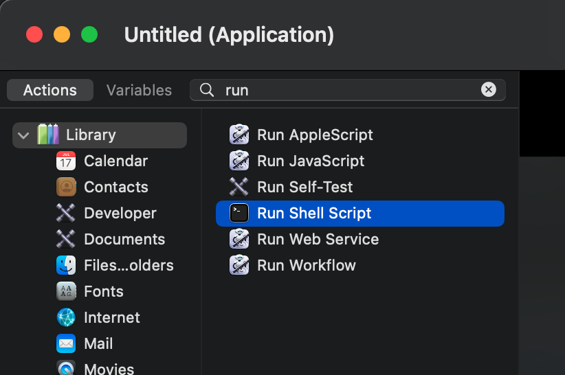
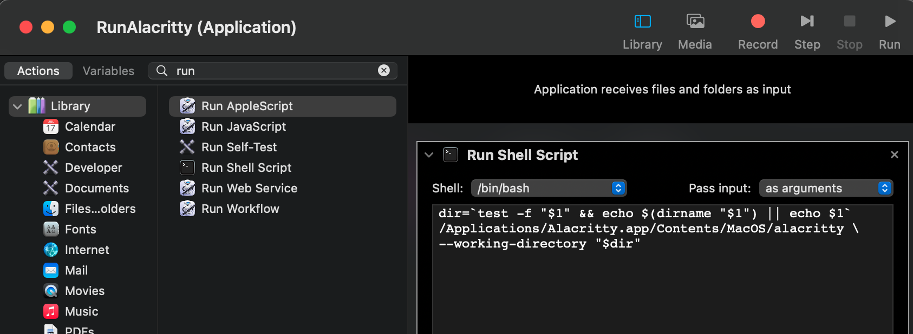
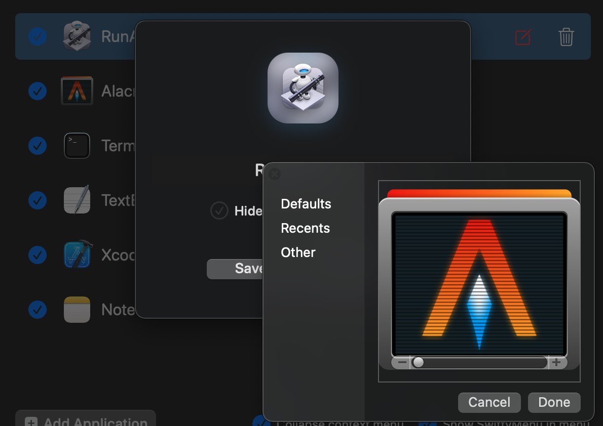
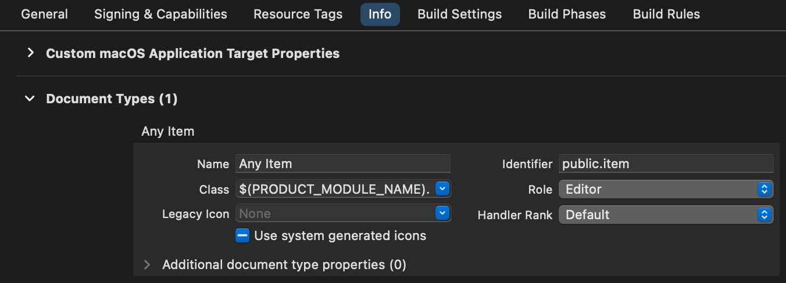
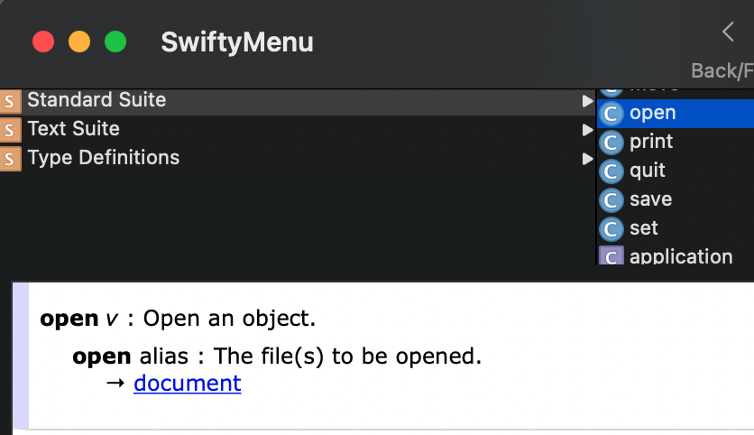
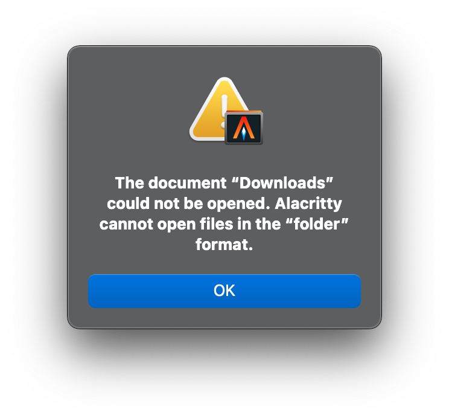

SwiftyMenu 上线后的第一个用户反馈，说 SwiftyMenu 无法唤起 Alacritty。

[Alacritty](https://github.com/alacritty/alacritty) 是一个开源的，用 Rust 编写的，OpenGL 渲染界面的跨平台终端。我下载了它的 Mac 版本，的确不能在 SwiftyMenu 中正常打开目录。我看了一会儿，SwiftyMenu 无法在没有脚本执行功能的情况下调用 Alacritty，但有一个 workaround 的办法。

## Automator

Automator 可以把执行脚本包装成一个简单的应用，把这样的应用拖进 SwiftyMenu 中也能变向实现执行脚本的功能。

Automator **新建 Application**，搜索 run 并添加 **Run Shell Script**:


**Pass input** 选择 **as arguments**，这样文件和目录会做为参数传入，我们就能在下面的脚本中用 `$1` 取得。

**添加以下脚本**：

```bash
dir=`test -f "$1" && echo $(dirname "$1") || echo $1`
/Applications/Alacritty.app/Contents/MacOS/alacritty \
--working-directory "$dir"
```



**导出成应用程序**并添加到（拖入也可以） SwiftyMenu 的应用列表里。为了看起来更像 Alacritty，你还可以把 Alacritty 的图标设置为这个 Automator 应用的图标。



至此，SwiftyMenu 的菜单就可以唤起 Alacritty 了。

同理，TypeScript 编写的 [Hyper](https://github.com/vercel/hyper) 不能在 SwiftyMenu 中使用也可以这个方法解决，它的脚本是：

```bash
dir=`test -f "$1" && echo $(dirname "$1") || echo $1`
/Applications/Hyper.app/Contents/Resources/bin/hyper "$dir"
```

那么，让应用打开文件或目录到底是怎么一回事呢？有兴趣了解背后原因的用户请继续往下看。

## 类型关联

通常，大部分 Mac 系统下原生的编辑工具、终端都支持打开文件或目录，要实现这一点，在程序的 Info.plist 中有这样一段：

```xml
<key>CFBundleDocumentTypes</key>
<array>
    <dict>
        <key>CFBundleTypeName</key>
        <string>Any Item</string>
        <key>CFBundleTypeRole</key>
        <string>Editor</string>
        <key>LSHandlerRank</key>
        <string>Default</string>
        <key>LSItemContentTypes</key>
        <array>
            <string>public.item</string>
        </array>
        <key>NSDocumentClass</key>
        <string>$(PRODUCT_MODULE_NAME).Document</string>
    </dict>
</array>
```

它在 Xcode 中的设置：


这里的 `public.item` 被称为 UTIs(Uniform Type Identifiers) —— 统一类型标识。在 [Uniform Type Identifier Concepts](https://developer.apple.com/library/archive/documentation/FileManagement/Conceptual/understanding_utis/understand_utis_intro/understand_utis_intro.html) 这份文档里能找到以下几种不同方式分类而产生的层级树，比如：


用 `public.item` 相当于接受所有文件，如果改成 `public.image`，那就只有图片能被接受。

应用一旦声明了 Document Types，它就可以：

### 1. 把目录或文件拖到应用的图标上

这可能是最直观的方式，比较符合大部分人的操作直觉。

### 2. 作为默认的文件类型关联

假设一个 app 在 Document Types 里注册作为 `public.image` 的 Editor 或者 Viewer，当你在 Finder 中选中了一个图片文件，你就能在它的右键菜单的 Open with 中看到这个 app。如果这个 app 作为图片文件的首要打开方式，那么直接双击文件就能用这个 app 打开这个文件。

当然，仅仅关联文件是不够的，应用还得实现真正的打开功能才能打开文件和目录。

## AppleScript 或 JavaScript 调用

应用可以通过支持 AppleScript 对 Mac 生态更加友好，
[Making A Mac App Scriptable Tutorial](https://www.raywenderlich.com/1033-making-a-mac-app-scriptable-tutorial) 这个教程中介绍了具体的实现细节。

在 Info.plist 中声明支持脚本操作：

```xml
<key>NSAppleScriptEnabled</key>
<true/>
```

那么在 Script Editor 的 Library 里，就能看到 Standard Suite：



比如这份 AppleScript 用 CotEditor 打开它自己的 Info.plist：

```applescript
tell application "CotEditor"
    activate
    open "/Applications/CotEditor.app/Contents/Info.plist"
end tell
```

## 参数传递

应用也可以不关联任何 UTIs，而是改用解析参数的方式，让用户能在 CLI 中打开指定文件或目录。

系统自带的 `/usr/bin/open`，能根据打开的对象的选择合适的应用，和在 Finder 中双击差不多：

```
open ~/Downloads
```
因为 ~/Downloads 目录的 UTI 是 `public.directory`，它的首要关联 Viewer 是 Finder，所以会打开 Finder 并进入到 ~/Downloads 目录。

如果我们要用 iTerm 打开这个目录，就不能依靠 Document Types 了，而是要把目录作为参数传递：

```bash
open -n /Applications/iTerm.app --args ~/Downloads
```

或者更加直接地执行应用的二进制可执行文件：

```bash
/Applications/iTerm.app/Contents/MacOS/iTerm2 ~/Downloads
```

## 问题原因

现在回到我们的问题，SwiftyMenu 打开文件或目录，使用的是：

```swift
let openConfig = NSWorkspace.OpenConfiguration()
openConfig.createsNewApplicationInstance = false

do {
    try NSWorkspace.shared.open(
        urls, // 被打开的文件或目录的数组
        withApplicationAt: applicationURL, // 应用程序的本地地址
        options: [],
        configuration: [:]
    )
} catch {
    os_log(.error, "%@", error.localizedDescription)
}
```

相当于执行了：

```bash
open -a "/Applications/Sublime Text.app" ~/Downloads
```

而 Alacritty 没有声明支持任何 UTIs，不会和目录与普通文件建立关联，它也没有打开文件或目录的功能。所以如果执行：

```bash
open -a "/Applications/Alacritty.app" ~/Downloads
```

会看到这个错误：


但是如果调用它的可执行文件，可以看到：

```bash
/Applications/Alacritty.app/Contents/MacOS/alacritty --help
alacritty 0.8.0 (a1b13e6)
Christian Duerr <contact@christianduerr.com>
Joe Wilm <joe@jwilm.com>
A fast, cross-platform, OpenGL terminal emulator

USAGE:
    alacritty [FLAGS] [OPTIONS]

FLAGS:
    -h, --help            Prints help information
        --hold            Remain open after child process exits
        --print-events    Print all events to stdout
    -q                    Reduces the level of verbosity (the min level is -qq)
        --ref-test        Generates ref test
    -v                    Increases the level of verbosity (the max level is -vvv)
    -V, --version         Prints version information

OPTIONS:
        --class <instance> | <instance>,<general>    Defines window class/app_id on X11/Wayland [default: Alacritty]
    -e, --command <command>...                       Command and args to execute (must be last argument)
        --config-file <config-file>
            Specify alternative configuration file [default: $HOME/.config/alacritty/alacritty.yml]

        --embed <embed>
            Defines the X11 window ID (as a decimal integer) to embed Alacritty within

    -o, --option <option>...                         Override configuration file options [example: cursor.style=Beam]
    -t, --title <title>                              Defines the window title [default: Alacritty]
        --working-directory <working-directory>      Start the shell in the specified working directory
```

那么打开目录其实可以执行：

```bash
/Applications/Alacritty.app/Contents/MacOS/alacritty \
--working-directory ~/Downloads
```

但是由于执行脚本的功能一直没能通过审核，SwiftyMenu 无法直接运行脚本，期待这个功能早日通过审核😂。


